# 👋 Hi, I'm Priyanshu Singha

### 💻 B.Tech CSE (AI/ML) | Python Developer | AI/ML Enthusiast

I build practical applications using Python, Machine Learning,
Generative AI and modern web technologies.
## 👨‍💻 About Me

🎓 I'm a **B.Tech Computer Science & Engineering (AI/ML)** student passionate about building intelligent and practical software solutions.

💻 I enjoy working with **Python, Java, C, JavaScript, React, Django, and Node.js**, with a strong interest in **Artificial Intelligence, Machine Learning, and Full-Stack Development**.

🤖 I'm currently exploring **Deep Learning, Generative AI, Agentic AI, and AI-powered applications**, while strengthening my **Data Structures & Algorithms** skills.

🚀 I love turning ideas into real-world projects, from **AI/ML applications and predictive systems to modern web platforms**.

📚 I'm continuously learning, experimenting with new technologies, and improving my problem-solving and software development skills.

🎯 **Goal:** To become a skilled **AI/ML Engineer and Full-Stack Developer** and build technology that solves meaningful real-world problems.
## 🐍 Contribution Snake

  

## 📊 GitHub Statistics

  

  

## 🏆 GitHub Trophies

  

## 🛠️ Tech Stack & Skills

### 💻 Programming Languages

  

---

### 🎨 Frontend Development

  

---

### 🤖 AI / Machine Learning & Data Science

  

  
  
  
  

**Core:** Machine Learning • Data Analysis • Data Visualization • Deep Learning

---

### 🗄️ Databases

  

---

### ⚙️ Backend Development

  

---

### 🔧 Development Tools

  

  
  

---

### ☁️ Cloud & Deployment

  

  

---

### 📚 Currently Exploring

  
  
  
  

## 🚀 Featured Projects

### 🤖 GenAI Code Architect

GenAI-powered code generation and automated test synthesis
using Genetic Algorithms.

**Tech:** React • Python • GenAI • Genetic Algorithms

---

### 📈 StockVision AI

Machine-learning based stock analysis and prediction platform.

**Tech:** Python • Django • Scikit-learn • TensorFlow • MySQL

---

### 🛒 E-Commerce Platform

Full-stack e-commerce application with authentication,
products, cart and database integration.

**Tech:** React • Node.js • MongoDB

---

### 🌦️ Climate Forecasting

Machine-learning based environmental forecasting application.

**Tech:** Python • Machine Learning • React
## 📫 Connect With Me

